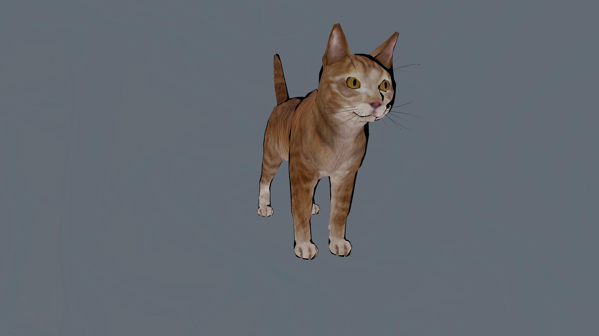
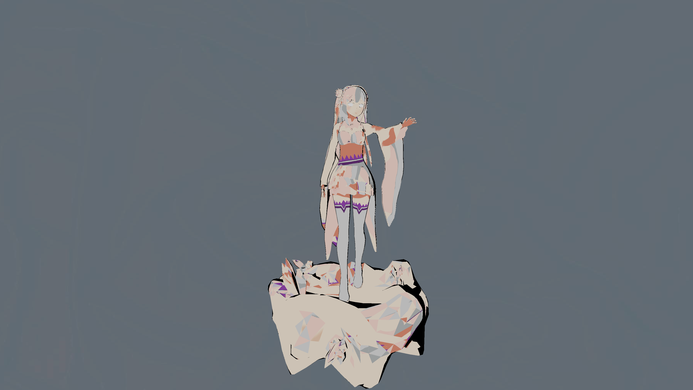
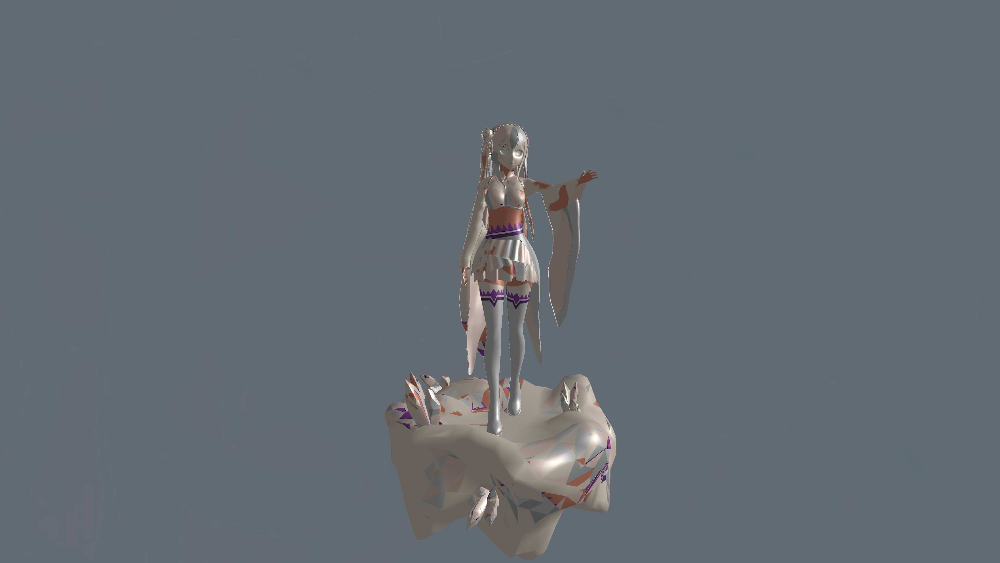
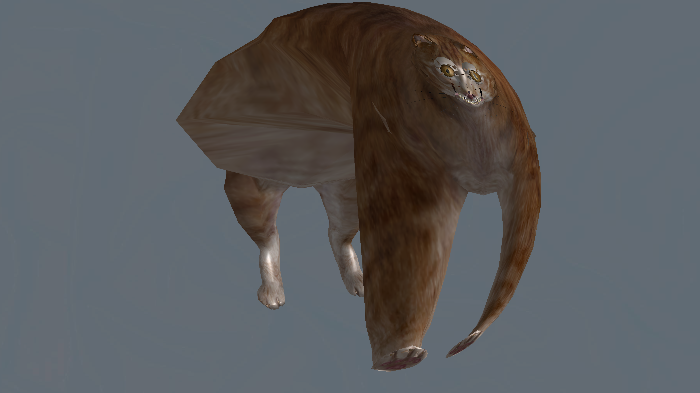

# CG_competition

This repository contains my OpenGL submission for the computer graphics competitions.
Currently the main things that is added is basic cell shading, which you can enable
in the UI alongside the other shaders (note that the gouraud shading does not load any texture data).
The other addition is adding anisotropic filtering.
I originally intended to add support for multiple textures (+ raw data loading), but I end up not setting
aside enough time for that. Hence the code currently includes some incomplete code related to that.
It is worth noting that the code already supports multiple model loading, however all models are
not unitized and are all fixed on the same location in world space.

There are also a few fixes made from the base code:
- Optimized model rendering by loading static mesh data in initializeGL, instead of in paintGL
    (which in hindsight was kind of obvious to do so).
- Improved efficientcy of shader switching by ensuring that uniforms are extracted only the
    first time the shader is loaded.

Compiling the code:
I do not use CGCREATER so I will describe here how to build the project using the
existing build utilities.
In the src directory do:
- run "cmake" CMakeLists.txt to generate the Makefile
- run "make"
- run "./OpenGL"

# Showcase
Here is how the cat model looks like using cell shading:

Cell-shading is commonly used in anime-style games/3d animations to
replicate the style and feel of the 2D drawings. So here is an
example of cell shading on an anime character:

which fits a bit better than the phong illumination:

(Note that the texture mapping is not correct)

Unrelated. But when you normalize all vertices on the cat model you
get this monstrosity:

(note that Phong shader is used here)
